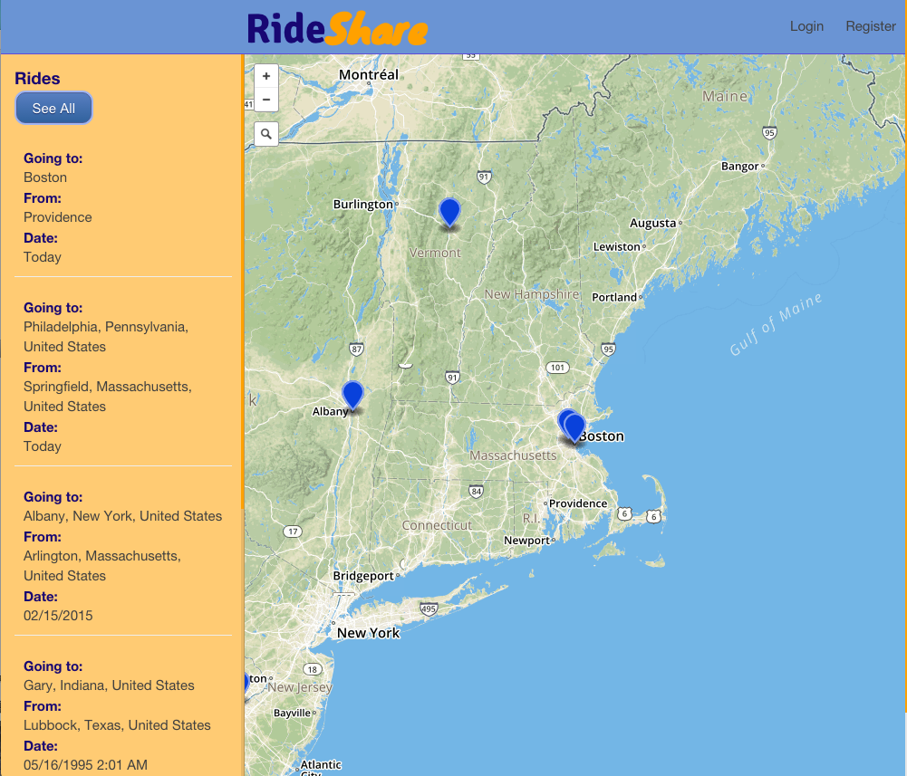

# RideShare Api 

##Links
* [Deployed Front End](http://raq929.github.io/ride-share-front-end/)
* [Deployed Back End](https://glacial-atoll-7078.herokuapp.com)
* [Front End Repo](https://github.com/raq929/ride-share-front-end)

##Installation
This app uses a postgres database, so you will need PostgreSQL installed.
Run a bundle install and you should be good to go! 

##My Process
I really enjoyed making my second Rails app! I learned a lot about relationships between tables doing this app, and I was really pleased that I got my serializers working so that I could get all of the information I needed on the front end from one get request. 
